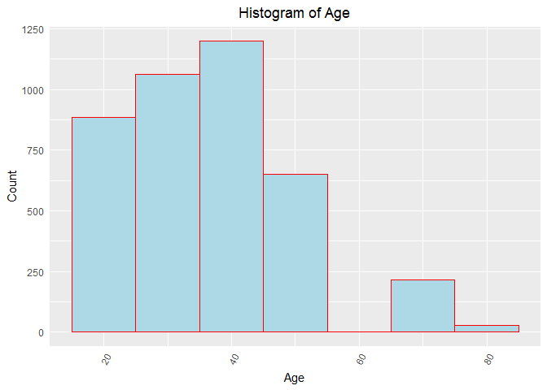
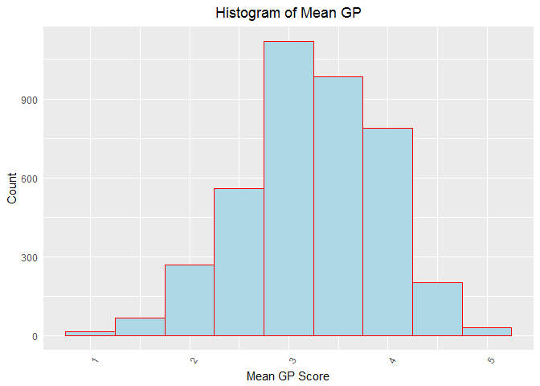
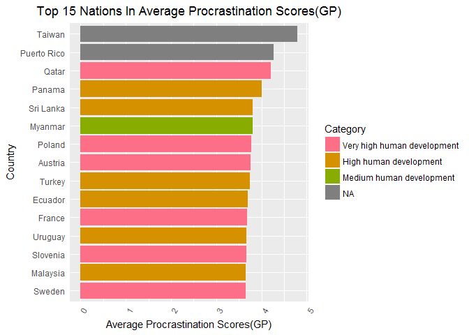
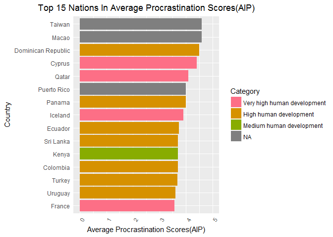
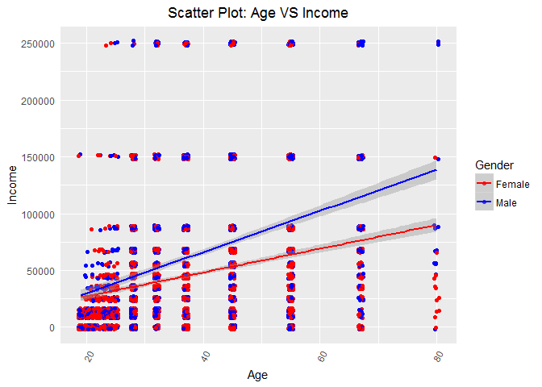
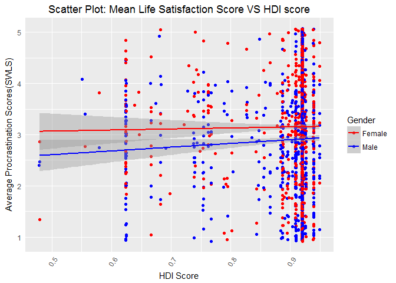
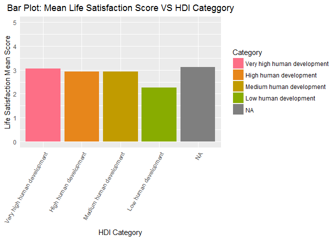

### Introduction

This report summarizes the statistical analysis, analysis results and analysis plots associated with the procrastination data set.

The purpose of this report is to illustrate data processing and modelling method used in this analysis as well as inferences and conclusions one can draw from it.

Project target is providing the analysis result to clients who want to get a preliminary understanding of how procrastination and life satisfaction scale are associated with the following factors:

* Age
	
* Gender
	
* Children (having children or not and how many children)
	
* Education Level
	
* Work Status (full time or part time)
	
* Annual Income
	
* Occupation
	
* Years of Experience
	
* Community Size
	
* Country of Residence (HDIs of Nations)
	
* Marital Status

* HDI score and HDI category

Project report including:

* Statistical analysis:

	+ keep all observations where the participant is above 18
	
	+ provide descriptive statistics on age, income, HDI and mean scores of decisional procrastination, procrastination behavior, generalized procrastination and life satisfaction

	+ provide histograms of Age and mean score of generalized procrastination

	+ provide tables of the number count of participants in the survey by gender, work status and occupation
	
	+ provide table of the number count of participants in the survey per country in descending order
	
	+ provide how many people said they felt they were procrastinators and also said others thought they were procrastinators
	
	+ provide a plot which displays top 15 nations in average generalized procrastination score
	
	+ provide a plot which displays top 15 nations in average procrastination behavior score
	
	+ find out the relationship between age and income
	
	+ find out the relationship between life satisfaction score and HDI score
	
	+ find out the relationship between life satisfaction score and HDI category
	
* Conclusion and references from the statistical analysis 

* Output files (in csv format) can be found in the repository.

### Analysis processes

#### Import of procrastination data

##### 2.a Importing the procrastination data that we got from the client and get the dimension of the data. This data set has 4262 rows and 61 columns.


```r
procrastination_data <- read.csv("Data/Procrastination.csv",stringsAsFactors = FALSE)

kable(cbind(c("Rows","Columns"),dim(procrastination_data)),row.names = FALSE ,  caption = "Dimension of procrastination dataset",format='html')%>%
  kable_styling(dim(procrastination_data),bootstrap_options='striped',full_width=FALSE)
```

<table class="table table-striped" style="width: auto !important; margin-left: auto; margin-right: auto;">
<caption>Dimension of procrastination dataset</caption>
<tbody>
<tr>
<td style="text-align:left;"> Rows </td>
   <td style="text-align:left;"> 4264 </td>
  </tr>
<tr>
<td style="text-align:left;"> Columns </td>
   <td style="text-align:left;"> 61 </td>
  </tr>
</tbody>
</table>


#### Munging the imported data 

##### 2.b Renaming the values of the columns to limit the size of all variable names to 12 characters or less. We have a lot of questions from different questionnaires, due to the fact that we are more interested in the average score from these questionnaires we are simply going to create sequential names based on the source questionnaire. 


```r
#a function that removes all of the periods from variable names and makes the name into Camel Case form.
camel <- function(x){ #function for camel case
    capit <- function(x) paste0(toupper(substring(x, 1, 1)), substring(x, 2, nchar(x)))
    sapply(strsplit(x, "\\."), function(x) paste(capit(x), collapse=""))
}

names(procrastination_data)<-camel(names(procrastination_data))

#a manual update of variable names that are too long or not descriptive. 
procrastination_data<- rename(x=procrastination_data,replace=c("HowLongHaveYouHeldThisPositionYears"="ExpYears", "Edu"="Education",
"CountryOfResidence"="Country", 
"ÏAge"="Age",                              
"HowLongHaveYouHeldThisPositionMonths"="ExpMonths",
"DoYouConsiderYourselfAProcrastinator"="SelfQuestion",
"NumberOfDaughters" = "Daughters", 
"NumberOfSons" = "Sons",
"CurrentOccupation"="Job",
"CommunitySize"="Community",
"MaritalStatus"="Marital",
"DoOthersConsiderYouAProcrastinator"="OthQuestion",
"AnnualIncome"="Income"))

#This will rename the columns of the different questionnaires 

colnames(procrastination_data)[grep(names(procrastination_data),pattern = "GP")] <- sprintf("GPQues%d",1:length(grep(names(procrastination_data),pattern = "GP")))
colnames(procrastination_data)[grep(names(procrastination_data),pattern = "AIP")] <- sprintf("AIPQues%d",1:length(grep(names(procrastination_data),pattern = "AIP")))
colnames(procrastination_data)[grep(names(procrastination_data),pattern = "SWLS")] <- sprintf("SWLSQues%d",1:length(grep(names(procrastination_data),pattern = "SWLS")))
colnames(procrastination_data)[grep(names(procrastination_data),pattern = "DP")] <- sprintf("DPQues%d",1:length(grep(names(procrastination_data),pattern = "DP")))
```

##### 2.c Cleaning up the data. We are eliminating values that don't make sense as well as errors that occurred when the data was exported.

* There are unrealistic and null values in the years of experience data, those values will be assigned to zero. We also round up values to only one digit.


```r
#Years of experience
#For years of experience any unrealistic value or null value is assigned 
procrastination_data$ExpYears <-as.numeric(procrastination_data$ExpYears)

procrastination_data$ExpYears[procrastination_data$ExpYears==999 | is.na(procrastination_data$ExpYears)] <- 0

procrastination_data$ExpYears <- round(procrastination_data$ExpYears,digits=1)
```

* There are zeros in the occupation data. We are replacing zeros with NA and there are blanks in the Income data, which we are replacing with zeroes.


```r
#We are replacing mis identified
procrastination_data$Job[procrastination_data$Job=="0"] <- "NA"

#Any blank income is assigned a value of 0
procrastination_data$Income[is.na(procrastination_data$Income)] <- 0
```

* Relabeling the number of sons data. The data is labelled as Male and Female. Here we relabel the genders back to integers with Male=1 and Female =2.


```r
procrastination_data$Sons[procrastination_data$Sons=="Male"] <- "1"
procrastination_data$Sons[procrastination_data$Sons=="Female"] <- "2"
procrastination_data$Sons <- as.integer(procrastination_data$Sons)
```

* Update the kids data to only Yes and No.


```r
#The Kids data is updated to only Yes or no
procrastination_data$Kids <- ifelse(grepl(procrastination_data$Kids,pattern = "Yes"),"Yes","No") 
```

* Update the age data. We are truncating all values of age after the decimal.


```r
#We are truncating all values of age after the decimal
procrastination_data$Age <- trunc(procrastination_data$Age,digits=0)
```

* There are zero values in the country of residence. We are replacing them with NA to treat this as missing.


```r
#This is to replace all 0 values of Country with an empty string
procrastination_data$Country[procrastination_data$Country=="0"] <- "NA"
procrastination_data$Country[procrastination_data$Country=="Columbia"] <- "Colombia"
```

* There are blanks and random numbers in the answers under the question: 
	* Do you consider yourself a procrastinator?
	* Do others consider you a procrastinator?
	* Here we assign them a NA value.
	

```r
#Any blank answers in the procrastination questionnaires are assigned a Yes value
procrastination_data$OthQuestion[procrastination_data$OthQuestion==""] <- "NA"
procrastination_data$SelfQuestion[procrastination_data$SelfQuestion==""] <- "NA"
procrastination_data$SelfQuestion[procrastination_data$SelfQuestion == '0'] <- "NA"
procrastination_data$SelfQuestion[procrastination_data$SelfQuestion == '4'] <- "NA"
```

#### 2.d We are checking to see the format of the data we received. This will ensure easy manipulation and produce less errors when we combine the data with other information.


```r
kable(cbind("Column Name"= names(procrastination_data),"Column Type" = rapply(procrastination_data,typeof)),row.names = FALSE, format = 'html',
      caption = "Data type by Variable")%>%
  kable_styling(cbind("Column Name"= names(procrastination_data),"Column Type" = rapply(procrastination_data,typeof)),bootstrap_options='striped',full_width=FALSE)
```

<table class="table table-striped" style="width: auto !important; margin-left: auto; margin-right: auto;">
<caption>Data type by Variable</caption>
 <thead><tr>
<th style="text-align:left;"> Column Name </th>
   <th style="text-align:left;"> Column Type </th>
  </tr></thead>
<tbody>
<tr>
<td style="text-align:left;"> Age </td>
   <td style="text-align:left;"> double </td>
  </tr>
<tr>
<td style="text-align:left;"> Gender </td>
   <td style="text-align:left;"> character </td>
  </tr>
<tr>
<td style="text-align:left;"> Kids </td>
   <td style="text-align:left;"> character </td>
  </tr>
<tr>
<td style="text-align:left;"> Education </td>
   <td style="text-align:left;"> character </td>
  </tr>
<tr>
<td style="text-align:left;"> WorkStatus </td>
   <td style="text-align:left;"> character </td>
  </tr>
<tr>
<td style="text-align:left;"> Income </td>
   <td style="text-align:left;"> double </td>
  </tr>
<tr>
<td style="text-align:left;"> Job </td>
   <td style="text-align:left;"> character </td>
  </tr>
<tr>
<td style="text-align:left;"> ExpYears </td>
   <td style="text-align:left;"> double </td>
  </tr>
<tr>
<td style="text-align:left;"> ExpMonths </td>
   <td style="text-align:left;"> integer </td>
  </tr>
<tr>
<td style="text-align:left;"> Community </td>
   <td style="text-align:left;"> character </td>
  </tr>
<tr>
<td style="text-align:left;"> Country </td>
   <td style="text-align:left;"> character </td>
  </tr>
<tr>
<td style="text-align:left;"> Marital </td>
   <td style="text-align:left;"> character </td>
  </tr>
<tr>
<td style="text-align:left;"> Sons </td>
   <td style="text-align:left;"> integer </td>
  </tr>
<tr>
<td style="text-align:left;"> Daughters </td>
   <td style="text-align:left;"> integer </td>
  </tr>
<tr>
<td style="text-align:left;"> DPQues1 </td>
   <td style="text-align:left;"> integer </td>
  </tr>
<tr>
<td style="text-align:left;"> DPQues2 </td>
   <td style="text-align:left;"> integer </td>
  </tr>
<tr>
<td style="text-align:left;"> DPQues3 </td>
   <td style="text-align:left;"> integer </td>
  </tr>
<tr>
<td style="text-align:left;"> DPQues4 </td>
   <td style="text-align:left;"> integer </td>
  </tr>
<tr>
<td style="text-align:left;"> DPQues5 </td>
   <td style="text-align:left;"> integer </td>
  </tr>
<tr>
<td style="text-align:left;"> AIPQues1 </td>
   <td style="text-align:left;"> integer </td>
  </tr>
<tr>
<td style="text-align:left;"> AIPQues2 </td>
   <td style="text-align:left;"> integer </td>
  </tr>
<tr>
<td style="text-align:left;"> AIPQues3 </td>
   <td style="text-align:left;"> integer </td>
  </tr>
<tr>
<td style="text-align:left;"> AIPQues4 </td>
   <td style="text-align:left;"> integer </td>
  </tr>
<tr>
<td style="text-align:left;"> AIPQues5 </td>
   <td style="text-align:left;"> integer </td>
  </tr>
<tr>
<td style="text-align:left;"> AIPQues6 </td>
   <td style="text-align:left;"> integer </td>
  </tr>
<tr>
<td style="text-align:left;"> AIPQues7 </td>
   <td style="text-align:left;"> integer </td>
  </tr>
<tr>
<td style="text-align:left;"> AIPQues8 </td>
   <td style="text-align:left;"> integer </td>
  </tr>
<tr>
<td style="text-align:left;"> AIPQues9 </td>
   <td style="text-align:left;"> integer </td>
  </tr>
<tr>
<td style="text-align:left;"> AIPQues10 </td>
   <td style="text-align:left;"> integer </td>
  </tr>
<tr>
<td style="text-align:left;"> AIPQues11 </td>
   <td style="text-align:left;"> integer </td>
  </tr>
<tr>
<td style="text-align:left;"> AIPQues12 </td>
   <td style="text-align:left;"> integer </td>
  </tr>
<tr>
<td style="text-align:left;"> AIPQues13 </td>
   <td style="text-align:left;"> integer </td>
  </tr>
<tr>
<td style="text-align:left;"> AIPQues14 </td>
   <td style="text-align:left;"> integer </td>
  </tr>
<tr>
<td style="text-align:left;"> AIPQues15 </td>
   <td style="text-align:left;"> integer </td>
  </tr>
<tr>
<td style="text-align:left;"> GPQues1 </td>
   <td style="text-align:left;"> integer </td>
  </tr>
<tr>
<td style="text-align:left;"> GPQues2 </td>
   <td style="text-align:left;"> integer </td>
  </tr>
<tr>
<td style="text-align:left;"> GPQues3 </td>
   <td style="text-align:left;"> integer </td>
  </tr>
<tr>
<td style="text-align:left;"> GPQues4 </td>
   <td style="text-align:left;"> integer </td>
  </tr>
<tr>
<td style="text-align:left;"> GPQues5 </td>
   <td style="text-align:left;"> integer </td>
  </tr>
<tr>
<td style="text-align:left;"> GPQues6 </td>
   <td style="text-align:left;"> integer </td>
  </tr>
<tr>
<td style="text-align:left;"> GPQues7 </td>
   <td style="text-align:left;"> integer </td>
  </tr>
<tr>
<td style="text-align:left;"> GPQues8 </td>
   <td style="text-align:left;"> integer </td>
  </tr>
<tr>
<td style="text-align:left;"> GPQues9 </td>
   <td style="text-align:left;"> integer </td>
  </tr>
<tr>
<td style="text-align:left;"> GPQues10 </td>
   <td style="text-align:left;"> integer </td>
  </tr>
<tr>
<td style="text-align:left;"> GPQues11 </td>
   <td style="text-align:left;"> integer </td>
  </tr>
<tr>
<td style="text-align:left;"> GPQues12 </td>
   <td style="text-align:left;"> integer </td>
  </tr>
<tr>
<td style="text-align:left;"> GPQues13 </td>
   <td style="text-align:left;"> integer </td>
  </tr>
<tr>
<td style="text-align:left;"> GPQues14 </td>
   <td style="text-align:left;"> integer </td>
  </tr>
<tr>
<td style="text-align:left;"> GPQues15 </td>
   <td style="text-align:left;"> integer </td>
  </tr>
<tr>
<td style="text-align:left;"> GPQues16 </td>
   <td style="text-align:left;"> integer </td>
  </tr>
<tr>
<td style="text-align:left;"> GPQues17 </td>
   <td style="text-align:left;"> integer </td>
  </tr>
<tr>
<td style="text-align:left;"> GPQues18 </td>
   <td style="text-align:left;"> integer </td>
  </tr>
<tr>
<td style="text-align:left;"> GPQues19 </td>
   <td style="text-align:left;"> integer </td>
  </tr>
<tr>
<td style="text-align:left;"> GPQues20 </td>
   <td style="text-align:left;"> integer </td>
  </tr>
<tr>
<td style="text-align:left;"> SWLSQues1 </td>
   <td style="text-align:left;"> integer </td>
  </tr>
<tr>
<td style="text-align:left;"> SWLSQues2 </td>
   <td style="text-align:left;"> integer </td>
  </tr>
<tr>
<td style="text-align:left;"> SWLSQues3 </td>
   <td style="text-align:left;"> integer </td>
  </tr>
<tr>
<td style="text-align:left;"> SWLSQues4 </td>
   <td style="text-align:left;"> integer </td>
  </tr>
<tr>
<td style="text-align:left;"> SWLSQues5 </td>
   <td style="text-align:left;"> integer </td>
  </tr>
<tr>
<td style="text-align:left;"> SelfQuestion </td>
   <td style="text-align:left;"> character </td>
  </tr>
<tr>
<td style="text-align:left;"> OthQuestion </td>
   <td style="text-align:left;"> character </td>
  </tr>
</tbody>
</table>

#### 2.e Creating columns for the mean of DP, AIP, GP and SWLS to represent the individual's average decisional procrastination, procrastination behavior, generalized procrastination and life satisfaction. We round the mean up to only one digit.


```r
#Here we are greping all of the variables with certain criteria in their names and creating a new variable of the mean of variables
procrastination_data$GPMean <- rowMeans(procrastination_data[,grep(names(procrastination_data),pattern = "GP")])
procrastination_data$AIPMean <- rowMeans(procrastination_data[,grep(names(procrastination_data),pattern = "AIP")])
procrastination_data$SWLSMean <- rowMeans(procrastination_data[,grep(names(procrastination_data),pattern = "SWLS")])
procrastination_data$DPMean <- rowMeans(procrastination_data[,grep(names(procrastination_data),pattern = "DP")])

#We are rounding the characters to only 1 digit after the decimal
procrastination_data$GPMean <- round(procrastination_data$GPMean,digits=1)
procrastination_data$AIPMean <- round(procrastination_data$AIPMean,digits=1)
```

* The job titles also need to be organized. 

	* In this process, any job title with 'please specify' will be assigned to a NA to be treated as missing.
	
	* All students are titled as student.
	
	* Professional job titles are being assigned to a more general term, i.e. yoga teacher and ESL teacher were simplified to teacher.
	
	* Everyone with a job status of Unemployed with a blank occupation is assigned the value Unemployed for their occupation 
	
	* All Job titles under 5 characters were made to an empty string.
	
	* All jobs with a slash (/) had all text after the slash removed.
	
	* All jobs with parentheses had the parentheses removed.
	
	* All jobs with leading and trailing white space were trimmed.
	

```r
camelpreserve <- function(x){ #function for camel case
    capit <- function(temp_x) {
      temp_x<-tolower(temp_x)
      paste0(toupper(substring(temp_x, 1, 1)), substring(temp_x, 2, nchar(temp_x)))
    }
    capit2 <- function(temp_x) {
      paste0(toupper(substring(temp_x, 1, 1)), substring(temp_x, 2, nchar(temp_x)))
    }
    x2<-sapply(strsplit(x, "[ ]+"), function(x) paste(capit(x), collapse=" "))
    sapply(strsplit(x2, "\\-"), function(x2) paste(capit2(x2), collapse="-"))
}

#Any job title where the person filled in please specify is made into an empty string.

procrastination_data$Job[grep(procrastination_data$Job,pattern = "please specify")] <- "NA"

#All students are titled as student. As well if someone put their work status as Student then their occupation was updated to student
procrastination_data$Job[grep(procrastination_data$WorkStatus,pattern = "[sS]tudent")] <- "Student"
procrastination_data$Job[grep(procrastination_data$Job,pattern = "[sS]tudent")] <- "Student"

#These are statements to make professional job titles more general, i.e. yoga teacher and ESL teacher were simplified to teacher
procrastination_data$Job[grep(procrastination_data$Job,pattern = "[tT]eacher")] <- "Teacher"
procrastination_data$Job[grep(procrastination_data$Job,pattern = "[wW]riter")] <- "Writer"
procrastination_data$Job[grep(procrastination_data$Job,pattern = "RN|[nN]urse|LPN|PCA")] <- "Nurse"
procrastination_data$Job[grep(procrastination_data$Job,pattern = "[cC][ ]*[eE][ ]*[oO]|[Cc]hief")] <- "Executive"
procrastination_data$Job[grep(procrastination_data$Job,pattern = "IT|[Nn]etwork")] <- "Information Technology"
procrastination_data$Job[grep(procrastination_data$Job,pattern = "[dD]octor|[mM][dD]")] <- "Doctor"
procrastination_data$Job[grep(procrastination_data$Job,pattern = "[sS]ales")] <- "Sales"
procrastination_data$Job[grep(procrastination_data$Job,pattern = "[Aa]cademic")] <- "Academic"
procrastination_data$Job[grep(procrastination_data$Job,pattern = "[Pp]roducer")] <- "Producer"
procrastination_data$Job[grep(procrastination_data$Job,pattern = "[Ss]upervis")] <- "Supervisor"
procrastination_data$Job[grep(procrastination_data$Job,pattern = "[Dd]esigner")] <- "Designer"
procrastination_data$Job[grep(procrastination_data$Job,pattern = "[Ff]inanc|[Bb]ank")] <- "Finance"
procrastination_data$Job[grep(procrastination_data$Job,pattern = "[Ss]oftware")] <- "Software Developer"
procrastination_data$Job[grep(procrastination_data$Job,pattern = "houswife|\\Shome|^home")] <- "Homemaker"
procrastination_data$Job[grep(procrastination_data$Job,pattern = "[Ee]ngineer")] <- "Engineer"
procrastination_data$Job[grep(procrastination_data$Job,pattern = "[Rr]eal [Ee]state")] <- "Real Estate"

procrastination_data$Job[grep(procrastination_data$Job,pattern = "[Aa]dmin")] <- "Administration"
procrastination_data$Job[grep(procrastination_data$Job,pattern = "[Aa]nalyst")] <- "Analyst"
procrastination_data$Job[grep(procrastination_data$Job,pattern = "[Aa]rt")] <- "Art"
procrastination_data$Job[grep(procrastination_data$Job,pattern = "[Aa]ssist")] <- "Assistant"
procrastination_data$Job[grep(procrastination_data$Job,pattern = "[Aa]ttor")] <- "Attorney"
procrastination_data$Job[grep(procrastination_data$Job,pattern = "[Bb]usiness")] <- "Business"
procrastination_data$Job[grep(procrastination_data$Job,pattern = "[Cc]linical")] <- "Clinical"
procrastination_data$Job[grep(procrastination_data$Job,pattern = "[Cc]ommunications")] <- "Communication"
procrastination_data$Job[grep(procrastination_data$Job,pattern = "[Cc]omputer")] <- "Computer"
procrastination_data$Job[procrastination_data$Job==""] <- "NA"
#Everyone with a job status of Unemployed with a blank occupation is assigned the value Unemployed for their occupation 
procrastination_data$Job[procrastination_data$WorkStatus=="unemployed"& procrastination_data$Job==""] <- "Unemployed"

#All Job titles under 5 characters were made to an empty string
procrastination_data$Job[nchar(procrastination_data$Job)<5] <- ""
procrastination_data$Job[procrastination_data$Job==""] <- "NA"

#All jobs with a slash(/) had all text after the slash removed
procrastination_data$Job<-sub("\\s*/.*", "", procrastination_data$Job)

#All jobs with parantheses had the parantheses removed
procrastination_data$Job<-sub("\\s*\\(.*", "", procrastination_data$Job)

#All jobs with leading and trailing white space were trimmed
procrastination_data$Job<-gsub("^\\s+|\\s+$", "", procrastination_data$Job)

procrastination_data$Job<-camelpreserve(procrastination_data$Job)

procrastination_data$Job[procrastination_data$Job==""] <- "NA"
```

* There are blanks in Gender data. We are replacing blanks with NA.


```r
procrastination_data$Gender[procrastination_data$Gender ==""] <- "NA"
```

* There are blanks in Working Status. We are replacing blanks with NA.

```r
procrastination_data$WorkStatus[procrastination_data$WorkStatus ==""] <- "NA"
```

#### Web Scraping Wikipedia

##### 3.ab We are pulling data (HDI for nations recognized by the United Nation only) from the Human Development Index page on Wikipedia. We will combine this data from different tables and assign it a category value based on the HDI score.


```r
#This is a function to combine multiple tables of scraped data that share a similar category
bindData <- function(firstframe,dataset,category){
	
#Here we are assigning the columns we need to some temporary variables and renaming the columns
working_temp <- dataset[[firstframe]][2:nrow(dataset[[firstframe]]),c(3,4)]
names(working_temp)<-c("Country","HDI")
working_temp1 <- dataset[[firstframe+1]][2:nrow(dataset[[firstframe+1]]),c(3,4)]
names(working_temp1)<-c("Country","HDI")

#We are binding the rows of our two temp variables and adding the Category value.
working_temp<-rbind(working_temp,working_temp1)
working_temp<-cbind(working_temp,"Category"=category)
}

url <- "https://en.wikipedia.org/wiki/List_of_countries_by_Human_Development_Index"

HDI_table <- url %>%
  read_html() %>%  
  html_nodes("table")%>%
html_table(fill=TRUE)

HDI <- data.frame("Country","HDI","Category")

HDI<-rbind(bindData(4,HDI_table,"Very high human development"),
           bindData(7,HDI_table,"High human development"),
           bindData(10,HDI_table,"Medium human development"),
           bindData(13,HDI_table,"Low human development"))
HDI$HDI <- as.numeric(HDI$HDI)
```

##### 3.c Merging our procrastination data to the HDI data pulled from Wikipedia. 


```r
#We are doing a left merge of the procrastination data on the HDI data pulled from Wikipedia. This means that if there is a missing country value from the procrastination data we will still bring that data over with missing HDI information.
merged_data<-merge(x=procrastination_data,y=HDI,by="Country",all.x=TRUE)
```

##### 4.a Based on the request from our client. We only study subjects over the age of 18 so we are selecting a subset of only ages that we can confirm are over the age of 18.And let columns have proper data type.


```r
cleaned_data <- merged_data[merged_data$Age>18 & !is.na(merged_data$Age),]
```

##### 4.b Presented below are the descriptive statistics on Age, Income, HDI, and for mean columns of GP, AIP, SWLS, and DP. There are two histograms for Age and Mean GP data. The histogram for Age is right skewed while the histogram for Mean GP is more symmetrical and bell shaped.


```r
agesummary <- summary(cleaned_data$Age)
incomesummary <-summary(cleaned_data$Income)
HDIsummary <- summary(cleaned_data$HDI)

kable(rbind(agesummary),row.names = FALSE,format='html',caption="Summary of Age")%>%
  kable_styling(rbind(agesummary),bootstrap_options='striped',full_width=FALSE)
```

<table class="table table-striped" style="width: auto !important; margin-left: auto; margin-right: auto;">
<caption>Summary of Age</caption>
 <thead><tr>
<th style="text-align:right;"> Min. </th>
   <th style="text-align:right;"> 1st Qu. </th>
   <th style="text-align:right;"> Median </th>
   <th style="text-align:right;"> Mean </th>
   <th style="text-align:right;"> 3rd Qu. </th>
   <th style="text-align:right;"> Max. </th>
  </tr></thead>
<tbody><tr>
<td style="text-align:right;"> 19 </td>
   <td style="text-align:right;"> 28 </td>
   <td style="text-align:right;"> 37 </td>
   <td style="text-align:right;"> 38.14445 </td>
   <td style="text-align:right;"> 45 </td>
   <td style="text-align:right;"> 80 </td>
  </tr></tbody>
</table>

```r
kable(rbind(incomesummary),row.names = FALSE,format='html',caption="Summary of Income Information")%>%
  kable_styling(rbind(incomesummary),bootstrap_options='striped',full_width=FALSE)
```

<table class="table table-striped" style="width: auto !important; margin-left: auto; margin-right: auto;">
<caption>Summary of Income Information</caption>
 <thead><tr>
<th style="text-align:right;"> Min. </th>
   <th style="text-align:right;"> 1st Qu. </th>
   <th style="text-align:right;"> Median </th>
   <th style="text-align:right;"> Mean </th>
   <th style="text-align:right;"> 3rd Qu. </th>
   <th style="text-align:right;"> Max. </th>
  </tr></thead>
<tbody><tr>
<td style="text-align:right;"> 0 </td>
   <td style="text-align:right;"> 10000 </td>
   <td style="text-align:right;"> 35000 </td>
   <td style="text-align:right;"> 53722.75 </td>
   <td style="text-align:right;"> 67500 </td>
   <td style="text-align:right;"> 250000 </td>
  </tr></tbody>
</table>

```r
kable(rbind(HDIsummary),row.names = FALSE,format='html',caption="Summary of HDI")%>%
  kable_styling(rbind(HDIsummary),bootstrap_options='striped',full_width=FALSE)
```

<table class="table table-striped" style="width: auto !important; margin-left: auto; margin-right: auto;">
<caption>Summary of HDI</caption>
 <thead><tr>
<th style="text-align:right;"> Min. </th>
   <th style="text-align:right;"> 1st Qu. </th>
   <th style="text-align:right;"> Median </th>
   <th style="text-align:right;"> Mean </th>
   <th style="text-align:right;"> 3rd Qu. </th>
   <th style="text-align:right;"> Max. </th>
   <th style="text-align:right;"> NA's </th>
  </tr></thead>
<tbody><tr>
<td style="text-align:right;"> 0.479 </td>
   <td style="text-align:right;"> 0.92 </td>
   <td style="text-align:right;"> 0.92 </td>
   <td style="text-align:right;"> 0.9054685 </td>
   <td style="text-align:right;"> 0.92 </td>
   <td style="text-align:right;"> 0.949 </td>
   <td style="text-align:right;"> 190 </td>
  </tr></tbody>
</table>

```r
meanGPsummary <- summary(cleaned_data$GPMean)
meanAIPSsummary <-summary(cleaned_data$AIPMean)
meanSWLsummary <-summary(cleaned_data$SWLSMean)
meanDPsummary <- summary(cleaned_data$DPMean)

kable(rbind(meanGPsummary),row.names = FALSE,format='html',caption="Summary of GP questionnaire averages")%>%
  kable_styling(rbind(meanGPsummary),bootstrap_options='striped',full_width=FALSE)
```

<table class="table table-striped" style="width: auto !important; margin-left: auto; margin-right: auto;">
<caption>Summary of GP questionnaire averages</caption>
 <thead><tr>
<th style="text-align:right;"> Min. </th>
   <th style="text-align:right;"> 1st Qu. </th>
   <th style="text-align:right;"> Median </th>
   <th style="text-align:right;"> Mean </th>
   <th style="text-align:right;"> 3rd Qu. </th>
   <th style="text-align:right;"> Max. </th>
  </tr></thead>
<tbody><tr>
<td style="text-align:right;"> 1 </td>
   <td style="text-align:right;"> 2.8 </td>
   <td style="text-align:right;"> 3.2 </td>
   <td style="text-align:right;"> 3.235233 </td>
   <td style="text-align:right;"> 3.8 </td>
   <td style="text-align:right;"> 5 </td>
  </tr></tbody>
</table>

```r
kable(rbind(meanAIPSsummary),row.names = FALSE,format='html',caption="Summary of AIP questionnaire averages")%>%
  kable_styling(rbind(meanAIPSsummary),bootstrap_options='striped',full_width=FALSE)
```

<table class="table table-striped" style="width: auto !important; margin-left: auto; margin-right: auto;">
<caption>Summary of AIP questionnaire averages</caption>
 <thead><tr>
<th style="text-align:right;"> Min. </th>
   <th style="text-align:right;"> 1st Qu. </th>
   <th style="text-align:right;"> Median </th>
   <th style="text-align:right;"> Mean </th>
   <th style="text-align:right;"> 3rd Qu. </th>
   <th style="text-align:right;"> Max. </th>
  </tr></thead>
<tbody><tr>
<td style="text-align:right;"> 1 </td>
   <td style="text-align:right;"> 2.4 </td>
   <td style="text-align:right;"> 2.9 </td>
   <td style="text-align:right;"> 2.963826 </td>
   <td style="text-align:right;"> 3.5 </td>
   <td style="text-align:right;"> 5 </td>
  </tr></tbody>
</table>

```r
kable(rbind(meanSWLsummary),row.names = FALSE,format='html',caption="Summary of SWLS questionnaire averages")%>%
  kable_styling(rbind(meanSWLsummary),bootstrap_options='striped',full_width=FALSE)
```

<table class="table table-striped" style="width: auto !important; margin-left: auto; margin-right: auto;">
<caption>Summary of SWLS questionnaire averages</caption>
 <thead><tr>
<th style="text-align:right;"> Min. </th>
   <th style="text-align:right;"> 1st Qu. </th>
   <th style="text-align:right;"> Median </th>
   <th style="text-align:right;"> Mean </th>
   <th style="text-align:right;"> 3rd Qu. </th>
   <th style="text-align:right;"> Max. </th>
  </tr></thead>
<tbody><tr>
<td style="text-align:right;"> 1 </td>
   <td style="text-align:right;"> 2.4 </td>
   <td style="text-align:right;"> 3 </td>
   <td style="text-align:right;"> 3.046779 </td>
   <td style="text-align:right;"> 3.8 </td>
   <td style="text-align:right;"> 5 </td>
  </tr></tbody>
</table>

```r
kable(rbind(meanDPsummary),row.names = FALSE,format='html',caption="Summary of DP questionnaire averages")%>%
  kable_styling(rbind(meanDPsummary),bootstrap_options='striped',full_width=FALSE)
```

<table class="table table-striped" style="width: auto !important; margin-left: auto; margin-right: auto;">
<caption>Summary of DP questionnaire averages</caption>
 <thead><tr>
<th style="text-align:right;"> Min. </th>
   <th style="text-align:right;"> 1st Qu. </th>
   <th style="text-align:right;"> Median </th>
   <th style="text-align:right;"> Mean </th>
   <th style="text-align:right;"> 3rd Qu. </th>
   <th style="text-align:right;"> Max. </th>
  </tr></thead>
<tbody><tr>
<td style="text-align:right;"> 1 </td>
   <td style="text-align:right;"> 2.4 </td>
   <td style="text-align:right;"> 3 </td>
   <td style="text-align:right;"> 3.051635 </td>
   <td style="text-align:right;"> 3.8 </td>
   <td style="text-align:right;"> 5 </td>
  </tr></tbody>
</table>

```r
#histogram of age
qplot(cleaned_data$Age, 
			geom="histogram",
      binwidth = 10,  
      main = "Histogram of Age", 
      xlab = "Age", ylab = 'Count', 
      fill=I("light blue"), 
      col=I("red"))+
	theme(plot.title=element_text(hjust = .5), axis.ticks.y=element_blank(),axis.ticks.x=element_blank()) +
	theme(axis.text.x = element_text(angle=60,hjust=1))
```

<!-- -->

```r
#histogram of mean GP
qplot(cleaned_data$GPMean, 
			geom="histogram",
      binwidth = 0.5,  
      main = "Histogram of Mean GP", 
      xlab = "Mean GP Score", ylab = 'Count', 
      fill=I("light blue"), 
      col=I("red"))+
	theme(plot.title=element_text(hjust = .5), axis.ticks.y=element_blank(),axis.ticks.x=element_blank()) +
  theme(axis.text.x = element_text(angle=60,hjust=1))
```

<!-- -->

##### 4.c.1 Presented below is a table of the number count of the participants in the survey by genders. If there are blanks in gender data, they will be assigned NA. Therefore, the gender column in the table will have females, males and NA.


```r
frequencyOfRespondantsByGender <- as.data.frame(table(cleaned_data$Gender))
colnames(frequencyOfRespondantsByGender) <- c("Gender","Number of Participants")
kable(frequencyOfRespondantsByGender[order(-frequencyOfRespondantsByGender$`Number of Participants`),],row.names = FALSE,format='html', caption = "Frequency of survey participants by gender")%>%
  kable_styling(frequencyOfRespondantsByGender[order(-frequencyOfRespondantsByGender$`Number of Participants`),],bootstrap_options='striped',full_width=FALSE)
```

<table class="table table-striped" style="width: auto !important; margin-left: auto; margin-right: auto;">
<caption>Frequency of survey participants by gender</caption>
 <thead><tr>
<th style="text-align:left;"> Gender </th>
   <th style="text-align:right;"> Number of Participants </th>
  </tr></thead>
<tbody>
<tr>
<td style="text-align:left;"> Female </td>
   <td style="text-align:right;"> 2309 </td>
  </tr>
<tr>
<td style="text-align:left;"> Male </td>
   <td style="text-align:right;"> 1721 </td>
  </tr>
<tr>
<td style="text-align:left;"> NA </td>
   <td style="text-align:right;"> 6 </td>
  </tr>
</tbody>
</table>


##### 4.c.2 Presented below is a table of the number count of the participants in the survey by Work Status. If there are blank values in work status data, they will be assigned NA. Therefore, the table will have full-time,  part-time, student, unemployed, retired, and NA.


```r
frequencyOfRespondantsByWork <- as.data.frame(table(cleaned_data$WorkStatus))
colnames(frequencyOfRespondantsByWork) <- c("Work","Number of Participants")
kable(frequencyOfRespondantsByWork[order(-frequencyOfRespondantsByWork$`Number of Participants`),],row.names = FALSE,format = 'html', caption = "Frequency of survey participants by work status")%>%
	kable_styling(frequencyOfRespondantsByWork[order(-frequencyOfRespondantsByWork$`Number of Participants`),],bootstrap_options='striped',full_width=FALSE)
```

<table class="table table-striped" style="width: auto !important; margin-left: auto; margin-right: auto;">
<caption>Frequency of survey participants by work status</caption>
 <thead><tr>
<th style="text-align:left;"> Work </th>
   <th style="text-align:right;"> Number of Participants </th>
  </tr></thead>
<tbody>
<tr>
<td style="text-align:left;"> full-time </td>
   <td style="text-align:right;"> 2260 </td>
  </tr>
<tr>
<td style="text-align:left;"> student </td>
   <td style="text-align:right;"> 837 </td>
  </tr>
<tr>
<td style="text-align:left;"> part-time </td>
   <td style="text-align:right;"> 465 </td>
  </tr>
<tr>
<td style="text-align:left;"> unemployed </td>
   <td style="text-align:right;"> 258 </td>
  </tr>
<tr>
<td style="text-align:left;"> retired </td>
   <td style="text-align:right;"> 174 </td>
  </tr>
<tr>
<td style="text-align:left;"> NA </td>
   <td style="text-align:right;"> 42 </td>
  </tr>
</tbody>
</table>

##### 4.c.3 Presented below is a table of the number count of the participants in the survey by Occupation. If there are blanks in job data, they will be assigned NA. This table has been summarized to the top 20 listed job types, the complete list of jobs and their frequency can be found in the output directory in job_data.csv.


```r
frequencyOfRespondantsByJob<- as.data.frame(table(cleaned_data$Job))
colnames(frequencyOfRespondantsByJob) <- c("Job","Number of Participants")
kable(head(frequencyOfRespondantsByJob[order(-frequencyOfRespondantsByJob$`Number of Participants`),],20),row.names = FALSE,format = 'html', caption = "Frequency of survey participants by occupation")%>%
	  kable_styling(head(frequencyOfRespondantsByJob[order(-frequencyOfRespondantsByJob$`Number of Participants`),],20),bootstrap_options='striped',full_width=FALSE)
```

<table class="table table-striped" style="width: auto !important; margin-left: auto; margin-right: auto;">
<caption>Frequency of survey participants by occupation</caption>
 <thead><tr>
<th style="text-align:left;"> Job </th>
   <th style="text-align:right;"> Number of Participants </th>
  </tr></thead>
<tbody>
<tr>
<td style="text-align:left;"> Na </td>
   <td style="text-align:right;"> 1966 </td>
  </tr>
<tr>
<td style="text-align:left;"> Student </td>
   <td style="text-align:right;"> 845 </td>
  </tr>
<tr>
<td style="text-align:left;"> Teacher </td>
   <td style="text-align:right;"> 88 </td>
  </tr>
<tr>
<td style="text-align:left;"> Attorney </td>
   <td style="text-align:right;"> 53 </td>
  </tr>
<tr>
<td style="text-align:left;"> College Professor </td>
   <td style="text-align:right;"> 42 </td>
  </tr>
<tr>
<td style="text-align:left;"> Writer </td>
   <td style="text-align:right;"> 41 </td>
  </tr>
<tr>
<td style="text-align:left;"> Engineer </td>
   <td style="text-align:right;"> 37 </td>
  </tr>
<tr>
<td style="text-align:left;"> Analyst </td>
   <td style="text-align:right;"> 35 </td>
  </tr>
<tr>
<td style="text-align:left;"> Assistant </td>
   <td style="text-align:right;"> 31 </td>
  </tr>
<tr>
<td style="text-align:left;"> Manager </td>
   <td style="text-align:right;"> 31 </td>
  </tr>
<tr>
<td style="text-align:left;"> Finance </td>
   <td style="text-align:right;"> 28 </td>
  </tr>
<tr>
<td style="text-align:left;"> Information Technology </td>
   <td style="text-align:right;"> 28 </td>
  </tr>
<tr>
<td style="text-align:left;"> Retired </td>
   <td style="text-align:right;"> 28 </td>
  </tr>
<tr>
<td style="text-align:left;"> Homemaker </td>
   <td style="text-align:right;"> 27 </td>
  </tr>
<tr>
<td style="text-align:left;"> Designer </td>
   <td style="text-align:right;"> 25 </td>
  </tr>
<tr>
<td style="text-align:left;"> Administration </td>
   <td style="text-align:right;"> 24 </td>
  </tr>
<tr>
<td style="text-align:left;"> Software Developer </td>
   <td style="text-align:right;"> 23 </td>
  </tr>
<tr>
<td style="text-align:left;"> Editor </td>
   <td style="text-align:right;"> 21 </td>
  </tr>
<tr>
<td style="text-align:left;"> Nurse </td>
   <td style="text-align:right;"> 21 </td>
  </tr>
<tr>
<td style="text-align:left;"> Marketing </td>
   <td style="text-align:right;"> 20 </td>
  </tr>
</tbody>
</table>

##### 4.d Presented below is a table of the number count of the participants in the survey per country. Blanks in the country data will be assigned to NA. This table has been summarized to the top 20 listed countries types, the complete list of countries and their frequency can be found in the output directory in country.csv.


```r
cleaned_data$Country[cleaned_data$Country==""] <- "NA"
frequencyOfRespondantsByCountry <- as.data.frame(table(cleaned_data$Country))
colnames(frequencyOfRespondantsByCountry) <- c("Country","Number of Participants")
kable(head(frequencyOfRespondantsByCountry[order(-frequencyOfRespondantsByCountry$`Number of Participants`),],20),row.names = FALSE,format = 'html', caption = "Frequency of survey participants by country")%>%
	 kable_styling(head(frequencyOfRespondantsByJob[order(-frequencyOfRespondantsByJob$`Number of Participants`),],20),bootstrap_options='striped',full_width=FALSE)
```

<table class="table table-striped" style="width: auto !important; margin-left: auto; margin-right: auto;">
<caption>Frequency of survey participants by country</caption>
 <thead><tr>
<th style="text-align:left;"> Country </th>
   <th style="text-align:right;"> Number of Participants </th>
  </tr></thead>
<tbody>
<tr>
<td style="text-align:left;"> United States </td>
   <td style="text-align:right;"> 2785 </td>
  </tr>
<tr>
<td style="text-align:left;"> Canada </td>
   <td style="text-align:right;"> 243 </td>
  </tr>
<tr>
<td style="text-align:left;"> United Kingdom </td>
   <td style="text-align:right;"> 177 </td>
  </tr>
<tr>
<td style="text-align:left;"> NA </td>
   <td style="text-align:right;"> 160 </td>
  </tr>
<tr>
<td style="text-align:left;"> Australia </td>
   <td style="text-align:right;"> 99 </td>
  </tr>
<tr>
<td style="text-align:left;"> India </td>
   <td style="text-align:right;"> 78 </td>
  </tr>
<tr>
<td style="text-align:left;"> Italy </td>
   <td style="text-align:right;"> 62 </td>
  </tr>
<tr>
<td style="text-align:left;"> Germany </td>
   <td style="text-align:right;"> 36 </td>
  </tr>
<tr>
<td style="text-align:left;"> Brazil </td>
   <td style="text-align:right;"> 20 </td>
  </tr>
<tr>
<td style="text-align:left;"> Ireland </td>
   <td style="text-align:right;"> 19 </td>
  </tr>
<tr>
<td style="text-align:left;"> Isreal </td>
   <td style="text-align:right;"> 19 </td>
  </tr>
<tr>
<td style="text-align:left;"> Netherlands </td>
   <td style="text-align:right;"> 18 </td>
  </tr>
<tr>
<td style="text-align:left;"> Sweden </td>
   <td style="text-align:right;"> 15 </td>
  </tr>
<tr>
<td style="text-align:left;"> Norway </td>
   <td style="text-align:right;"> 14 </td>
  </tr>
<tr>
<td style="text-align:left;"> France </td>
   <td style="text-align:right;"> 13 </td>
  </tr>
<tr>
<td style="text-align:left;"> Japan </td>
   <td style="text-align:right;"> 13 </td>
  </tr>
<tr>
<td style="text-align:left;"> Spain </td>
   <td style="text-align:right;"> 13 </td>
  </tr>
<tr>
<td style="text-align:left;"> China </td>
   <td style="text-align:right;"> 12 </td>
  </tr>
<tr>
<td style="text-align:left;"> Finland </td>
   <td style="text-align:right;"> 12 </td>
  </tr>
<tr>
<td style="text-align:left;"> Mexico </td>
   <td style="text-align:right;"> 12 </td>
  </tr>
</tbody>
</table>

##### 4.e Presented below is a total number of the matched answers from question: whether the person considers themselves a procrastinator and question: whether others consider them a procrastinator. There are 2358 people matched answer: yes (their perceptions to others) and 482 people matched answer: no.


```r
cleaned_data$matchingyes <- ifelse(cleaned_data$SelfQuestion=='yes'&cleaned_data$OthQuestion=='yes',1,0)
matchedyes <-sum(cleaned_data$matchingyes)


cleaned_data$matchingno <- ifelse(cleaned_data$SelfQuestion=='no'&cleaned_data$OthQuestion=='no',1,0)
matchedno <-sum(cleaned_data$matchingno)
kable(cbind(c("Matched Yes","Matched No"),c(matchedyes, matchedno)),row.names = FALSE,format = 'html', caption = "Number of individuals whose external and personal surveys matched")%>%
	 kable_styling(cbind(c("Matched Yes","Matched No"),c(matchedyes, matchedno)),bootstrap_options='striped',full_width=FALSE)
```

<table class="table table-striped" style="width: auto !important; margin-left: auto; margin-right: auto;">
<caption>Number of individuals whose external and personal surveys matched</caption>
<tbody>
<tr>
<td style="text-align:left;"> Matched Yes </td>
   <td style="text-align:left;"> 2358 </td>
  </tr>
<tr>
<td style="text-align:left;"> Matched No </td>
   <td style="text-align:left;"> 482 </td>
  </tr>
</tbody>
</table>

##### 5.b.1 Presented below is a bar chart displaying the top 15 nations in average procrastination scores using the measure of the General Procrastination (GP) score. Those regions are not recognized as sovereign nations will have NA values to their HDI score and HDI category.


```r
top15 <- aggregate(cleaned_data$GPMean,list(cleaned_data$Country),mean)
names(top15) <- c("Country", "GPMean")

merged15 <- merge(x=top15,y=HDI,by='Country',all.x =TRUE)

merged15$GPMean <- round(merged15$GPMean,3)
merged15<- merged15[with(merged15,order(-GPMean)),]
merged15 <- merged15[1:15,]
kable(merged15,row.names = FALSE,format = 'html', caption = "Top 15 countries by their GP Mean score")%>%
	kable_styling(merged15,bootstrap_options='striped',full_width=FALSE)
```

<table class="table table-striped" style="width: auto !important; margin-left: auto; margin-right: auto;">
<caption>Top 15 countries by their GP Mean score</caption>
 <thead><tr>
<th style="text-align:left;"> Country </th>
   <th style="text-align:right;"> GPMean </th>
   <th style="text-align:right;"> HDI </th>
   <th style="text-align:left;"> Category </th>
  </tr></thead>
<tbody>
<tr>
<td style="text-align:left;"> Taiwan </td>
   <td style="text-align:right;"> 4.800 </td>
   <td style="text-align:right;"> NA </td>
   <td style="text-align:left;"> NA </td>
  </tr>
<tr>
<td style="text-align:left;"> Puerto Rico </td>
   <td style="text-align:right;"> 4.267 </td>
   <td style="text-align:right;"> NA </td>
   <td style="text-align:left;"> NA </td>
  </tr>
<tr>
<td style="text-align:left;"> Qatar </td>
   <td style="text-align:right;"> 4.200 </td>
   <td style="text-align:right;"> 0.856 </td>
   <td style="text-align:left;"> Very high human development </td>
  </tr>
<tr>
<td style="text-align:left;"> Panama </td>
   <td style="text-align:right;"> 4.000 </td>
   <td style="text-align:right;"> 0.788 </td>
   <td style="text-align:left;"> High human development </td>
  </tr>
<tr>
<td style="text-align:left;"> Myanmar </td>
   <td style="text-align:right;"> 3.800 </td>
   <td style="text-align:right;"> 0.556 </td>
   <td style="text-align:left;"> Medium human development </td>
  </tr>
<tr>
<td style="text-align:left;"> Sri Lanka </td>
   <td style="text-align:right;"> 3.800 </td>
   <td style="text-align:right;"> 0.766 </td>
   <td style="text-align:left;"> High human development </td>
  </tr>
<tr>
<td style="text-align:left;"> Poland </td>
   <td style="text-align:right;"> 3.780 </td>
   <td style="text-align:right;"> 0.855 </td>
   <td style="text-align:left;"> Very high human development </td>
  </tr>
<tr>
<td style="text-align:left;"> Austria </td>
   <td style="text-align:right;"> 3.767 </td>
   <td style="text-align:right;"> 0.893 </td>
   <td style="text-align:left;"> Very high human development </td>
  </tr>
<tr>
<td style="text-align:left;"> Turkey </td>
   <td style="text-align:right;"> 3.744 </td>
   <td style="text-align:right;"> 0.767 </td>
   <td style="text-align:left;"> High human development </td>
  </tr>
<tr>
<td style="text-align:left;"> Ecuador </td>
   <td style="text-align:right;"> 3.700 </td>
   <td style="text-align:right;"> 0.739 </td>
   <td style="text-align:left;"> High human development </td>
  </tr>
<tr>
<td style="text-align:left;"> France </td>
   <td style="text-align:right;"> 3.685 </td>
   <td style="text-align:right;"> 0.897 </td>
   <td style="text-align:left;"> Very high human development </td>
  </tr>
<tr>
<td style="text-align:left;"> Slovenia </td>
   <td style="text-align:right;"> 3.667 </td>
   <td style="text-align:right;"> 0.890 </td>
   <td style="text-align:left;"> Very high human development </td>
  </tr>
<tr>
<td style="text-align:left;"> Uruguay </td>
   <td style="text-align:right;"> 3.667 </td>
   <td style="text-align:right;"> 0.795 </td>
   <td style="text-align:left;"> High human development </td>
  </tr>
<tr>
<td style="text-align:left;"> Malaysia </td>
   <td style="text-align:right;"> 3.650 </td>
   <td style="text-align:right;"> 0.789 </td>
   <td style="text-align:left;"> High human development </td>
  </tr>
<tr>
<td style="text-align:left;"> Sweden </td>
   <td style="text-align:right;"> 3.647 </td>
   <td style="text-align:right;"> 0.913 </td>
   <td style="text-align:left;"> Very high human development </td>
  </tr>
</tbody>
</table>

```r
ggplot(merged15, aes(reorder(Country, GPMean),GPMean)) + 
			geom_bar(stat="identity", aes(fill=Category))+  scale_fill_hue(h = c(5, 100)) +
      coord_flip() +
	
			ggtitle('Top 15 Nations In Average Procrastination Scores(GP)')+
			ylab('Average Procrastination Scores(GP)')+ 
			xlab('Country')+

			theme(plot.title=element_text(hjust = .5), axis.ticks.y=element_blank(),axis.ticks.x=element_blank()) +
  		theme(axis.text.x = element_text(angle=60,hjust=1))
```

<!-- -->

##### 5.c.1 Presented below is a bar chart displaying the top 15 nations in average procrastination scores using the measure of the Adult Inventory of Procrastination (AIP) score. Those regions are not recognized as sovereign nations will have NA values as their HDI score and HDI category.


```r
AIPtop15 <- aggregate(cleaned_data$AIPMean,list(cleaned_data$Country),mean)
names(AIPtop15) <- c("Country", "AIPMean")

AIPmerged15 <- merge(x=AIPtop15,y=HDI,by='Country',all.x =TRUE)

AIPmerged15$AIPMean <- round(AIPmerged15$AIPMean,3)
AIPmerged15<- AIPmerged15[with(AIPmerged15,order(-AIPMean)),]
AIPmerged15<- AIPmerged15[1:15,]

kable(AIPmerged15,row.names = FALSE,format = "html", caption = "Top 15 countries by their AIP Mean score")%>%
	  kable_styling(AIPmerged15,bootstrap_options='striped',full_width=FALSE)
```

<table class="table table-striped" style="width: auto !important; margin-left: auto; margin-right: auto;">
<caption>Top 15 countries by their AIP Mean score</caption>
 <thead><tr>
<th style="text-align:left;"> Country </th>
   <th style="text-align:right;"> AIPMean </th>
   <th style="text-align:right;"> HDI </th>
   <th style="text-align:left;"> Category </th>
  </tr></thead>
<tbody>
<tr>
<td style="text-align:left;"> Macao </td>
   <td style="text-align:right;"> 4.600 </td>
   <td style="text-align:right;"> NA </td>
   <td style="text-align:left;"> NA </td>
  </tr>
<tr>
<td style="text-align:left;"> Taiwan </td>
   <td style="text-align:right;"> 4.600 </td>
   <td style="text-align:right;"> NA </td>
   <td style="text-align:left;"> NA </td>
  </tr>
<tr>
<td style="text-align:left;"> Dominican Republic </td>
   <td style="text-align:right;"> 4.500 </td>
   <td style="text-align:right;"> 0.722 </td>
   <td style="text-align:left;"> High human development </td>
  </tr>
<tr>
<td style="text-align:left;"> Cyprus </td>
   <td style="text-align:right;"> 4.400 </td>
   <td style="text-align:right;"> 0.856 </td>
   <td style="text-align:left;"> Very high human development </td>
  </tr>
<tr>
<td style="text-align:left;"> Qatar </td>
   <td style="text-align:right;"> 4.100 </td>
   <td style="text-align:right;"> 0.856 </td>
   <td style="text-align:left;"> Very high human development </td>
  </tr>
<tr>
<td style="text-align:left;"> Panama </td>
   <td style="text-align:right;"> 4.000 </td>
   <td style="text-align:right;"> 0.788 </td>
   <td style="text-align:left;"> High human development </td>
  </tr>
<tr>
<td style="text-align:left;"> Puerto Rico </td>
   <td style="text-align:right;"> 4.000 </td>
   <td style="text-align:right;"> NA </td>
   <td style="text-align:left;"> NA </td>
  </tr>
<tr>
<td style="text-align:left;"> Iceland </td>
   <td style="text-align:right;"> 3.900 </td>
   <td style="text-align:right;"> 0.921 </td>
   <td style="text-align:left;"> Very high human development </td>
  </tr>
<tr>
<td style="text-align:left;"> Ecuador </td>
   <td style="text-align:right;"> 3.733 </td>
   <td style="text-align:right;"> 0.739 </td>
   <td style="text-align:left;"> High human development </td>
  </tr>
<tr>
<td style="text-align:left;"> Colombia </td>
   <td style="text-align:right;"> 3.700 </td>
   <td style="text-align:right;"> 0.727 </td>
   <td style="text-align:left;"> High human development </td>
  </tr>
<tr>
<td style="text-align:left;"> Kenya </td>
   <td style="text-align:right;"> 3.700 </td>
   <td style="text-align:right;"> 0.555 </td>
   <td style="text-align:left;"> Medium human development </td>
  </tr>
<tr>
<td style="text-align:left;"> Sri Lanka </td>
   <td style="text-align:right;"> 3.700 </td>
   <td style="text-align:right;"> 0.766 </td>
   <td style="text-align:left;"> High human development </td>
  </tr>
<tr>
<td style="text-align:left;"> Turkey </td>
   <td style="text-align:right;"> 3.678 </td>
   <td style="text-align:right;"> 0.767 </td>
   <td style="text-align:left;"> High human development </td>
  </tr>
<tr>
<td style="text-align:left;"> Uruguay </td>
   <td style="text-align:right;"> 3.600 </td>
   <td style="text-align:right;"> 0.795 </td>
   <td style="text-align:left;"> High human development </td>
  </tr>
<tr>
<td style="text-align:left;"> France </td>
   <td style="text-align:right;"> 3.562 </td>
   <td style="text-align:right;"> 0.897 </td>
   <td style="text-align:left;"> Very high human development </td>
  </tr>
</tbody>
</table>

```r
ggplot(AIPmerged15, aes(reorder(Country, AIPMean),AIPMean)) + 
			geom_bar(stat="identity", aes(fill=Category))+  scale_fill_hue(h = c(5, 100)) +
	    coord_flip() +    
  
			ggtitle('Top 15 Nations In Average Procrastination Scores(AIP)')+
			ylab('Average Procrastination Scores(AIP)')+ 
			xlab('Country')+

			theme(plot.title=element_text(hjust = .5), axis.ticks.y=element_blank(),axis.ticks.x=element_blank()) +
  		theme(axis.text.x = element_text(angle=60,hjust=1))+
      ylim(0,5)
```

<!-- -->


##### 5.c.2 Presented below is a table displaying nations and regions show up both in GP and AIP plot. 


```r
countrymatching<-intersect(merged15$Country,AIPmerged15$Country)
countrymatching <- data.frame(countrymatching)
names(countrymatching) <- c('Country')
countrymatching<-merge(countrymatching,subset(HDI,select=c("Country","Category")),by='Country',all.x = TRUE)

names(countrymatching) <- c('Country/Region','Category')

kable(countrymatching,row.names = FALSE,format = 'html', caption = "Countries in both the top AIP and GP ranking")%>%
	kable_styling(countrymatching,bootstrap_options='striped',full_width=FALSE)
```

<table class="table table-striped" style="width: auto !important; margin-left: auto; margin-right: auto;">
<caption>Countries in both the top AIP and GP ranking</caption>
 <thead><tr>
<th style="text-align:left;"> Country/Region </th>
   <th style="text-align:left;"> Category </th>
  </tr></thead>
<tbody>
<tr>
<td style="text-align:left;"> Ecuador </td>
   <td style="text-align:left;"> High human development </td>
  </tr>
<tr>
<td style="text-align:left;"> France </td>
   <td style="text-align:left;"> Very high human development </td>
  </tr>
<tr>
<td style="text-align:left;"> Panama </td>
   <td style="text-align:left;"> High human development </td>
  </tr>
<tr>
<td style="text-align:left;"> Puerto Rico </td>
   <td style="text-align:left;"> NA </td>
  </tr>
<tr>
<td style="text-align:left;"> Qatar </td>
   <td style="text-align:left;"> Very high human development </td>
  </tr>
<tr>
<td style="text-align:left;"> Sri Lanka </td>
   <td style="text-align:left;"> High human development </td>
  </tr>
<tr>
<td style="text-align:left;"> Taiwan </td>
   <td style="text-align:left;"> NA </td>
  </tr>
<tr>
<td style="text-align:left;"> Turkey </td>
   <td style="text-align:left;"> High human development </td>
  </tr>
<tr>
<td style="text-align:left;"> Uruguay </td>
   <td style="text-align:left;"> High human development </td>
  </tr>
</tbody>
</table>

*Finding: It appears that countries that show up in both categories have a high or very high level of development.

#### 5.d Presented below is to show the relationship between Age and Income.


```r
#scatter plot
ggplot(data=subset(cleaned_data,Gender=="Male"|Gender=="Female"), aes(Age, Income),color=Gender) + geom_jitter(aes(color=Gender)) + 
	scale_color_manual(breaks = c("Female", "Male", ""), values=c("red", "blue", "green")) + 
	geom_smooth(method='lm',mapping=aes(x=Age,y=Income,color=Gender))+
	
	ggtitle('Scatter Plot: Age VS Income')+
	
	theme(plot.title=element_text(hjust = .5), axis.ticks.y=element_blank(),axis.ticks.x=element_blank()) +
  theme(axis.text.x = element_text(angle=60,hjust=1))
```

<!-- -->

```r
#linear regression
AgeIncome <- lm(Income~Age:Gender,data = subset(cleaned_data,Gender=="Male"|Gender=="Female"))
difference <- AgeIncome$coefficients[3] - AgeIncome$coefficients[2]
```

* Finding: At younger ages it appears men and women have about the same mean income, but as they get older on average men will make more money than women. We are able to test that males earn 473.69 dollars more per year.

#### 5.e.1 Presented below is to show the relationship between Life Satisfaction and HDI Score.


```r
#scatter plot
ggplot(data=subset(cleaned_data,Gender=="Male"|Gender=="Female"), aes(HDI, SWLSMean),color=Gender) + geom_jitter(aes(color=Gender),na.rm = TRUE) + 
	scale_color_manual(breaks = c("Female", "Male", ""), values=c("red", "blue", "green")) + 
	geom_smooth(method='lm',mapping=aes(x=HDI,y=SWLSMean,color=Gender),na.rm = TRUE)+
	
	ggtitle('Scatter Plot: Mean Life Satisfaction Score VS HDI score')+
	ylab('Average Procrastination Scores(SWLS)')+ 
	xlab('HDI Score')+
	
	theme(plot.title=element_text(hjust = .5), axis.ticks.y=element_blank(),axis.ticks.x=element_blank()) +
  theme(axis.text.x = element_text(angle=60,hjust=1))
```

<!-- -->

* Finding: In countries that have lower HDI, females appear to have higher life satisfaction level than males. As the HDI increases, the life satisfaction difference between females and males is getting smaller.

#### 5.e.2 Presented below is to show the relationship between Life Satisfaction and HDI Category.


```r
ggplot(cleaned_data, aes(x=factor(Category), y=SWLSMean)) + 
			stat_summary(fun.y = mean, geom = "bar", aes(fill=Category)) +  scale_fill_hue(h = c(5, 100)) +
	
			ylab('Life Satisfaction Mean Score')+ 
			xlab('HDI Category')+
      ggtitle("Bar Plot: Mean Life Satisfaction Score VS HDI Categgory") + 
	
			theme(plot.title=element_text(hjust = .5), axis.ticks.y=element_blank(),axis.ticks.x=element_blank()) +
  		theme(axis.text.x = element_text(angle=60,hjust=1))+
      ylim(0,5)
```

<!-- -->

```r
df3 <- aggregate(SWLSMean~Category, data = cleaned_data, mean)
```

* Finding: In countries that have very high human development category, the life satisfaction mean scores are the highest. In countries that have low human development category, the life satisfaction mean scores are the lowest. In countries that have medium human development category, the life satisfaction mean scores are a little bit higher than those from high human development category. 

#### Conclusion
It appears from the data that procrastination is a first world problem, procrastination is a luxury that only those that are in high to very highly developed countries can afford. Whether this occurs in these countries because of selection bias, only countries with secure social welfare programs provide this segment of the population an opportunity to participate in these surveys, or if it is that only with higher standards of living are people able to procrastinate it is difficult to tell from this data. 

As a follow-up to this collection it is recommended that further study is done to see if the samples collected are true representations of the entire population of the country. We recommend that a random sample is polled on these different questionnaires from different levels of the HDI scale. This way we can tell if the samples from the countries with lower HDIs were under represented or if higher levels of procrastination are positively correlated to HDI score. 

#### Outputting data

##### 6.a Finalized HDI table


```r
HDIout <- write.csv(HDI, "../Output/HDI.csv", row.names=FALSE)
```

##### 6.b Tidied version of the original data

```r
cleaned_data <- write.csv(cleaned_data, "../Output/cleaned_data.csv", row.names=FALSE)
```

##### 6.c Top 15 nations in average procrastination scores using the measure of the GP score and AIP score 


```r
top15GP <- write.csv(merged15, "../Output/GP15.csv", row.names=FALSE)
top15AIP <- write.csv(AIPmerged15, "../Output/AIP15.csv", row.names=FALSE)
```

#####* Finalized job data


```r
cleaned_data$Job <- write.csv(cleaned_data$Job, "../Output/job_data.csv", row.names=FALSE)
```

#####\* Finalized output of Country by participants


```r
frequencyOfRespondantsByCountry <- write.csv(frequencyOfRespondantsByCountry, "../Output/Country.csv", row.names=FALSE)
```

